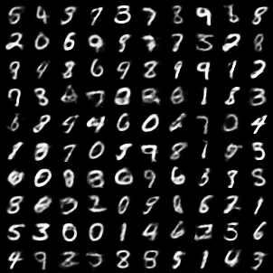
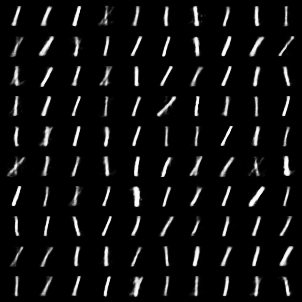
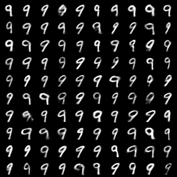

## VAE generate results
Sample 100 latent codes from normal distribution and input them into the trained decoder:

## CVAE generate results
Sample 100 latent codes from normal distribution and select the label of which image you want to generate, and then concat them to input into trained decoder:

**The expected label is 1:**

**The expected label is 9:**

## Note

If you  adjust the hyper-parameters carefully (such as the structure of the neural network, the dim of latent or the times of train), the results may be better.